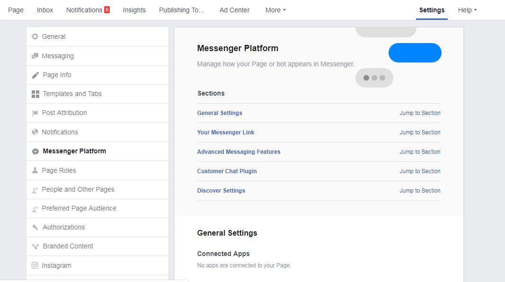
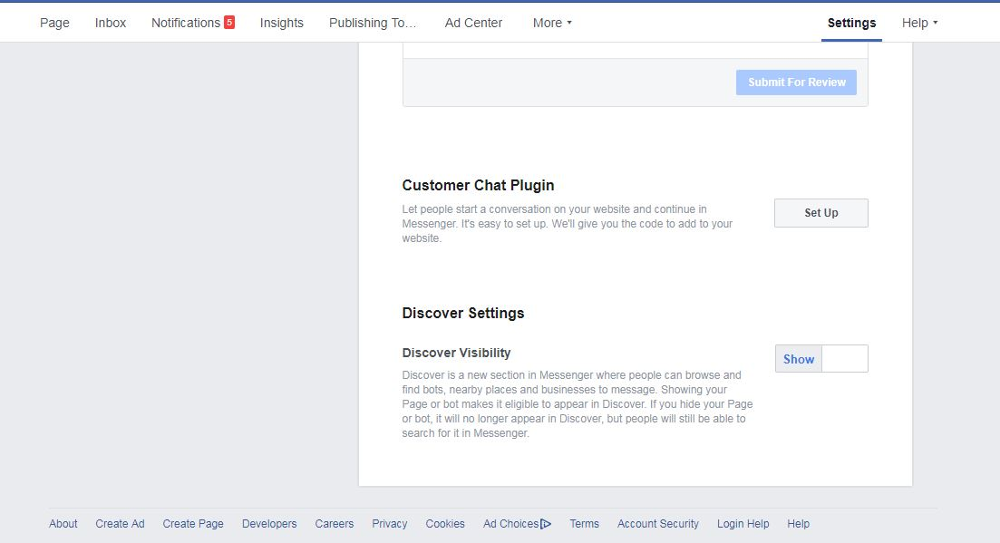
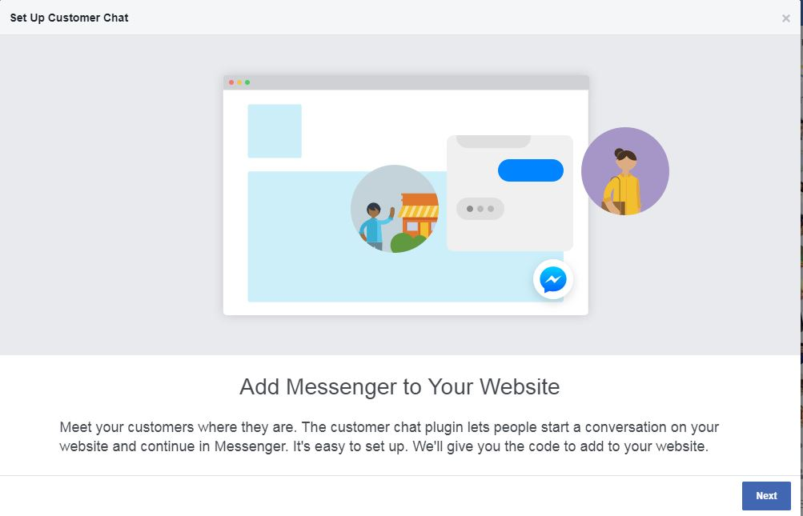
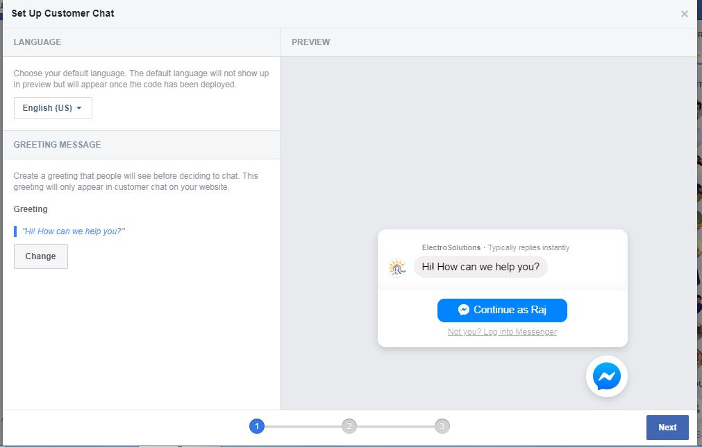
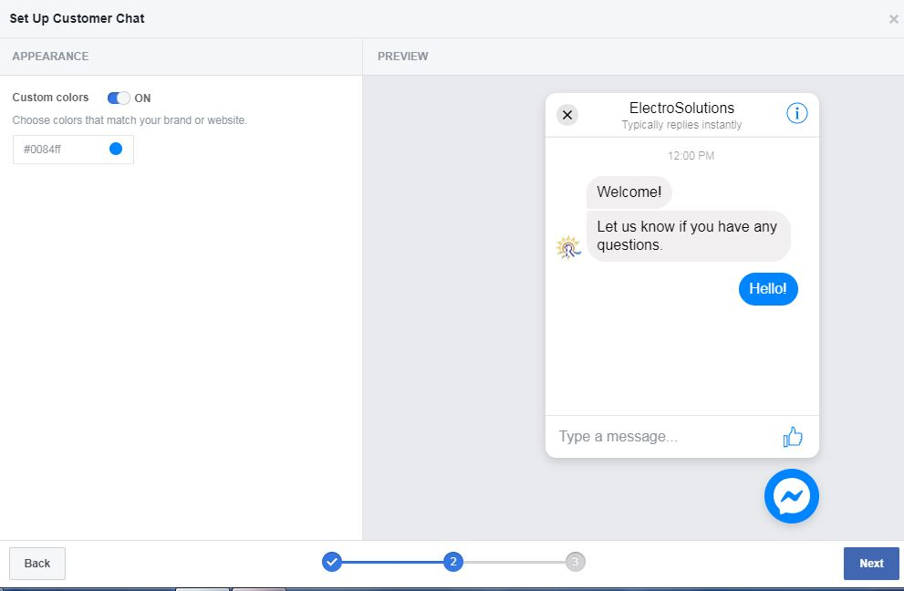
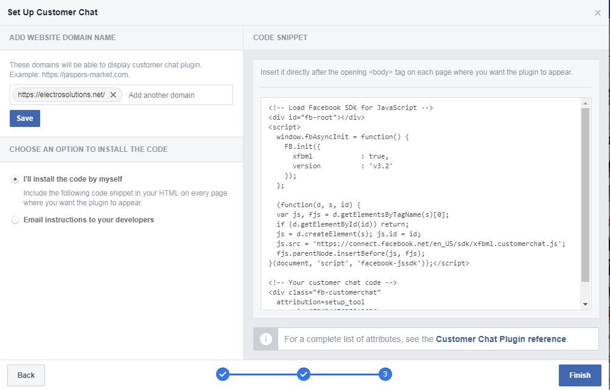
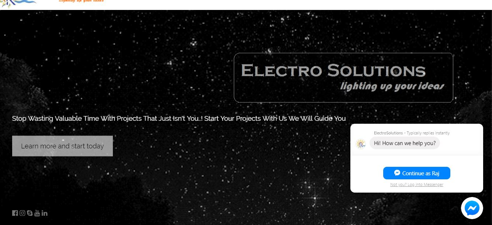

# ChatBot
Creating ChatBot for Websites,by including facebook messenger in you websites.

This can be done in may ways but here am mainly focusing on to begginer programmer so I feel it is the simplest way.

 Step1: First create a busniness page of your website on facebook using your Facebook account(Too easy thing if you dont know just google it) On your Business page Goto settings--> MessengerPlatform. 

 Step2: In MessengerPlatform search for customer Chat Plugins option and select set up.
 
 
 
 Step3: Follow the instructions shown on screen.
 

Step3: Here you can select language of your choice, You wish to interact with visitors of your website. And set a welcome note of ChatBot. 

Step4: Appearence of ChatBot like color,Size and position configuration.

Step5: Facebook will generate a snippet code for you which includes a unique Id for you page only (so dont share this with anyone. The same unique Id you can get it from creating a project in facebook developers page(This website is created by Facebook for developers only, You are free to create any number of projects and completely make use of facebook in your projects).
Copy the Code and paste it in your website code at the begging of body tag.

In case if your unable to follow all steps, I have added ready code for both a sample website and facebook snippet code, download it and your free to use modify. just create a business page in your facebook account and creat a project in Facebook developers website get uniqueId.

This picture shows a sample chatbot created for website electrosolutions.net

Here all the images are related to electrosolutions.in website for reference I have used it(which is one of my designed website only).
The other references are w3school.com
This article is only for education purpose.
